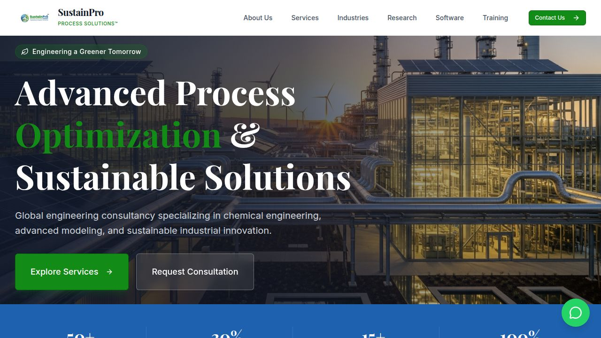

# 🌿 SustainPro

A modern, full-stack sustainability consulting website with a powerful admin portal. Built with React, TypeScript, Node.js, and SQLite.



---

## ✨ Features

### 🌐 Public Website
- **Dynamic Pages** — Home, About Us, Services, Industries, Software, Training, and more
- **Hero Slider** — Animated fullscreen hero banners
- **Faculty Advisors** — Profiles with university links
- **Contact Form** — Built-in contact/message submission
- **WhatsApp Integration** — Floating WhatsApp button
- **SEO Optimized** — Meta tags, semantic HTML, Open Graph
- **Fully Responsive** — Works on all screen sizes

### 🔐 Admin Portal (`/admin`)
- **Dashboard** — Stats overview at a glance
- **Content Management** — Services, Industries, Software, Training Categories
- **Training Programs** — Full programme listings (duration, mode, eligibility, start date,
  cover image, registration link) with enable/disable and display ordering; drives the
  public `/training` page
- **Page Builder** — Create and edit custom pages
- **Hero Slides & Banners** — Manage homepage sliders and page banners
- **Media Library** — Upload and manage images
- **Events, Notices, Messages** — Full CRUD management
- **Navigation Links** — Dynamic navbar management
- **Publications** — Research publications management
- **Contact Info, Footer, Donations, Settings** — All configurable
- **Authentication** — Secure login with JWT tokens

**Default Admin Login:**
- **Email:** `admin@sustainpro.com`
- **Password:** `Admin@123`

---

## 🛠️ Tech Stack

| Layer | Technology |
|-------|-----------|
| **Frontend** | React 19, TypeScript, Tailwind CSS v4, Wouter |
| **Admin Panel** | React 19, TypeScript, Tailwind CSS v4, Lucide Icons |
| **Backend API** | Node.js, Fastify, Drizzle ORM |
| **Database** | SQLite (via sql.js / WASM) |
| **Build Tool** | Vite 7, esbuild |
| **Package Manager** | pnpm (workspaces) |

---

## 🚀 Getting Started

### Prerequisites

Make sure you have the following installed:
- **Node.js** v18 or higher — [Download](https://nodejs.org/)
- **pnpm** v9 or higher — Install with: `npm install -g pnpm`

### 1. Clone the Repository

```bash
git clone https://github.com/chinmayvaghela96-hub/spro.git
cd spro
```

### 2. Install Dependencies

```bash
pnpm install
```

### 3. Build the Project

```bash
pnpm run build
```

### 4. Start the Servers

You need to start **3 services** — the API server, the admin panel, and the public website.

#### Option A: Run All Together (Recommended)

Open **3 separate terminals** in the project root:

**Terminal 1 — API Server (Port 3001):**
```bash
cd artifacts/api-server
PORT=3001 node dist/index.mjs
```
> On Windows: `set PORT=3001 && node dist/index.mjs`

**Terminal 2 — Admin Portal (Port 5001):**
```bash
pnpm --filter @workspace/admin run dev
```

**Terminal 3 — Public Website (Port 5000):**
```bash
PORT=5000 pnpm --filter @workspace/sustainpro run dev
```
> On Windows: `set PORT=5000 && pnpm --filter @workspace/sustainpro run dev`

#### Option B: Single Command (Windows PowerShell)

```powershell
$p1 = Start-Process cmd -ArgumentList "/c set PORT=3001 && node artifacts/api-server/dist/index.mjs" -PassThru -NoNewWindow
$p2 = Start-Process cmd -ArgumentList "/c npx pnpm --filter @workspace/admin run dev" -PassThru -NoNewWindow
$env:PORT="5000"; npx pnpm --filter @workspace/sustainpro run dev
```

### 5. Open in Browser

| Service | URL |
|---------|-----|
| 🌐 **Public Website** | [http://localhost:5000](http://localhost:5000) |
| 🔐 **Admin Portal** | [http://localhost:5000/admin](http://localhost:5000/admin) |
| ⚙️ **API Server** | [http://localhost:3001](http://localhost:3001) |

---

## 📁 Project Structure

```
spro/
├── artifacts/
│   ├── admin/              # Admin portal (React + Vite)
│   ├── api-server/         # Backend API (Fastify + Drizzle)
│   └── sustainpro/         # Public website (React + Vite)
├── lib/
│   ├── api-client-react/   # Generated API client hooks
│   ├── api-spec/           # OpenAPI specification
│   ├── api-zod/            # Zod validation schemas
│   └── db/                 # Database schema & migrations
├── scripts/                # Utility scripts
├── uploads/                # Uploaded media files
├── sustainpro.db           # SQLite database
├── package.json            # Root workspace config
├── pnpm-workspace.yaml     # pnpm workspace definition
└── tsconfig.base.json      # Shared TypeScript config
```

---

## 🗄️ Database

The project uses **SQLite** with the database file at `sustainpro.db`. Migrations are in `lib/db/drizzle/` and run automatically on server startup.

To reset the database, delete `sustainpro.db`, run the seed script, then start the API server:

```bash
node artifacts/api-server/dist/seed.mjs
```

> ⚠️ **Stop the API server before running the seed script.** The database is loaded
> through `sql.js`, so each process holds the *entire* database in memory and rewrites
> the whole file every 10 seconds. If the server is running while another process writes
> to `sustainpro.db`, the server's older in-memory snapshot overwrites those writes and
> the changes are silently lost. For the same reason, never run two API server instances
> against one database file.

Note that starting the API server alone creates the schema and seeds default pages and
hero slides, but the remaining content (homepage, services, training programs, etc.)
only appears after you run the seed script above.

---

## 🤝 Contributing

1. Fork the repository
2. Create your feature branch (`git checkout -b feature/amazing-feature`)
3. Commit your changes (`git commit -m 'Add amazing feature'`)
4. Push to the branch (`git push origin feature/amazing-feature`)
5. Open a Pull Request

---

## 📄 License

This project is licensed under the MIT License.

---

## 👨‍🏫 Faculty Advisors

- **Dr. Sridhar Dalai** — [Ahmedabad University Profile](https://ahduni.edu.in/faculty/sridhar-dalai/)
- **Dr. Dharamashi Rabari** — [Ahmedabad University Profile](https://ahduni.edu.in/academics/schools-centres/school-of-engineering-and-applied-science/people-1/dharamashi-rabari/)

---

Built with ❤️ by SustainPro Team
